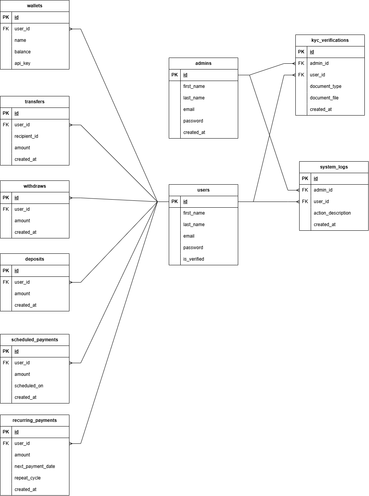
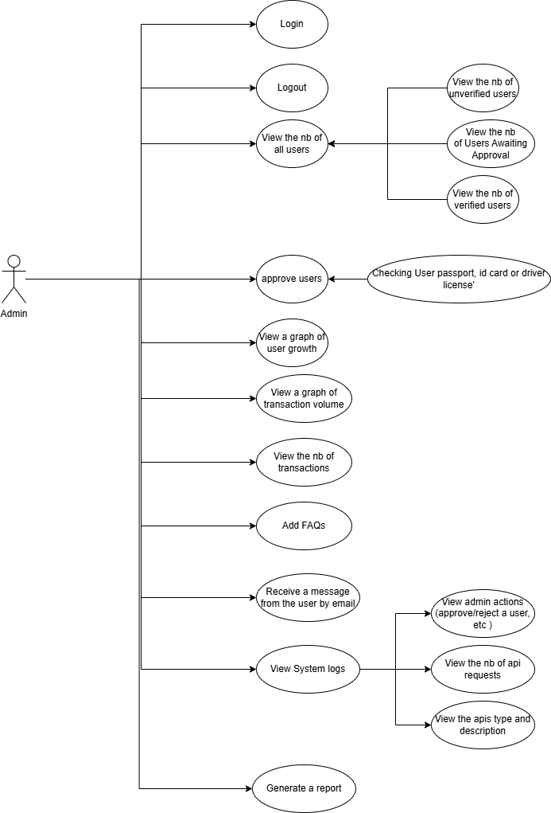
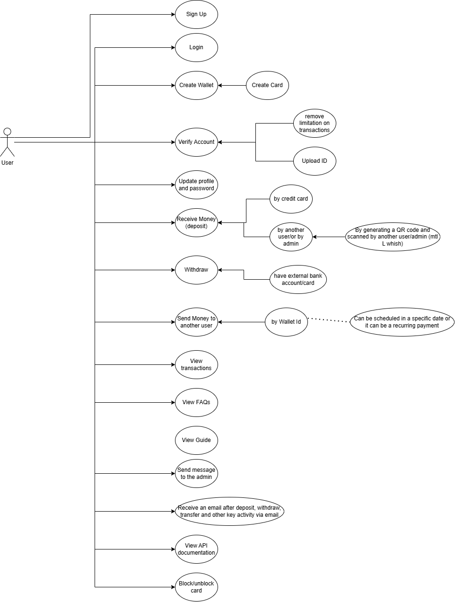

# Coolet

## 1. Use Case Diagram

## 2. ER Diagram

### Admin Use Case Diagram

### User Use Case Diagram

## 3. Document APIs

### Deposit API

- **URL:** `http://15.188.77.241/wallet-server/user/v1/deposit.php`
- **Method:** POST
- **Description:** Creates a deposit for a user's wallet.
- **Parameters:**
  - `user_id` (integer): The ID of the user making the deposit.
  - `wallet_id` (integer): The ID of the wallet to which the deposit is made.
  - `amount` (decimal): The deposit amount.

### Login API

- **URL:** `http://15.188.77.241/wallet-server/user/v1/login.php`
- **Method:** POST
- **Description:** Authenticates a user using email and password, returning user details upon success.
- **Parameters:**
  - `email` (string): The user's email address.
  - `pass` (string): The user's password.

### Signup API

- **URL:** `http://15.188.77.241/wallet-server/user/v1/signup.php`
- **Method:** POST
- **Description:** Registers a new user account.
- **Parameters:**
  - `first_name` (string): The user's first name.
  - `last_name` (string): The user's last name.
  - `email` (string): The user's email address.
  - `pass` (string): The user's password.

## 4. Hosting Details

- **API Address:** 15.188.77.241

## 5. Figma Design

- link: https://www.figma.com/design/52JSKRSHJCpN2r3Etw7IP3/Digtal-Wallet?node-id=0-1&p=f&t=9b3VBRWUJp2hcjlg-0
